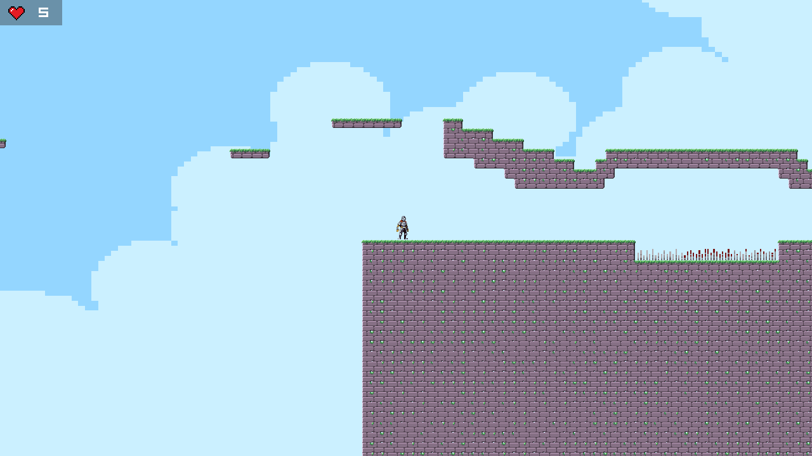

# Tvorba počítačové hry

## Základní koncepce

### Proveditelnost:

Metroidvania 2D pixelart platformer s leveling systemem inspirované hrami dead cells a hollow knight bude možné udělat, díky godot engine 4 s novými funkcemi a jednoduchosti tohoto žánru oproti ostatním (open world, atd.) a také díky jejímu art stylu bude jednoduché udělat levely pro hru.

### Zdroje:

Jako game engine bude použit godot engine

pro audio použijeme fl studio a pro nahrávání zvuků audacity, pro dodatečné zvuky se ještě použije sfxr(8-bit sound maker)

pro pixelart se samozřejmě použije asesprite a pro rychlé návrhy krita

### technologie:

godot engine – je lehký na pc, zabírá málo místa, má velmi dobrý způsob pro dělání 2d animací, atd.

Fl studio – nejlepší volba pro editování audia

audacity – jedna z nejlepších možností pro nahrávání audia a je to zadarmo

sfxr – hodně možnosti s různými filtry, frekvencemi, atd.

Asesprite – velmi doporučovaní software na pixelart

krita – dobrá zdarma alternativa oproti photoshopu

git – dobrý na správu a verzování kódu

### hrubý popis:

hra bude 2D platformovka s inspirací od dead cells a taky bude mít pixelart styl, hra bude mít velkou mapu, která bude mít několik biomů s různými nepříteli, kde hráč musí najít powerup kameny a získat nový skilly, které potom bude moc vylepšit buď u npc nebo v menu a misí hráče je pomoci npc

### pointa hry:

cílem hry je prozkoumat biomy na mapě a najít nové lokace, získat nové schopnosti(skilly) a porazit nepřátelé. Hra bude postavena na postupné zlepšování hráče, kde hráč bude muset mít dané skilly, aby postoupil dál. Tyto skilly bude muset hráč buď najít sám v biomech nebo bude moc získat radu od npc pokud jim pomůže.

### záměr:

přinést zážitek, který kombinuje prozkoumávání s rychlými souboji. Hra bude mít podobnou atmosféru jako hollow knight, ale s unikátními prvky

### grafika

Pro grafiku jsem zvolil asesprite, protože to je dedikovaný engine pro pixelart.
asesprite má hodně výhod oproti ostatním kreslícím programům tředa proti photoshopu má o dost lepší výkon a je o hodně menší.

### zvuky

Pro zvuky jsem zvolil bxfr což je skoro to stejný jako sfxr jediný rozdíl je více možností v bxfr. Jako test tohoto programu jsem skusil udělat zvuky pro skok a dash.
Pro skok už rovnou tam byl preset, kterej jsem použil jako baseline a snažil jsem se to udělat, aby to znělo lépe (všechny ty presety mají v sobě randomizer a jsou docela hodně highpitched).
Pro dash jsem skusil to udělat z jump presetu, ale musel jsem ho o dost více zkrátit kvůli délce dashe.

### finální hra

### Závěr
Zhodnocení práce:

Vývoj hry přinesl mnoho výzev, ale také cenné zkušenosti. Mezi největší úskalí patřilo:

    Level design – pro mě bylo obtížné navrhnout celkově mapu, protože jsem nikdy nedělal mapu.

    Movement - pro mě taky mi dalo zabrat pohyblivost a gravitace.

Co se povedlo?

✅ Úspěšně vytvořený základní prototyp s funkčními mechanikami.
✅ Funkční restart
✅ Připravené zvuky a animace.
Co by se dalo zlepšit?

🔹 Více nepřátel.
🔹 Více levelů a pause screen.
🔹 Hudba.

Celkově byl projekt pro mě docela velkým úspěchem po prví jsem udělal něco více než jenom mini demo s godot iconou.
